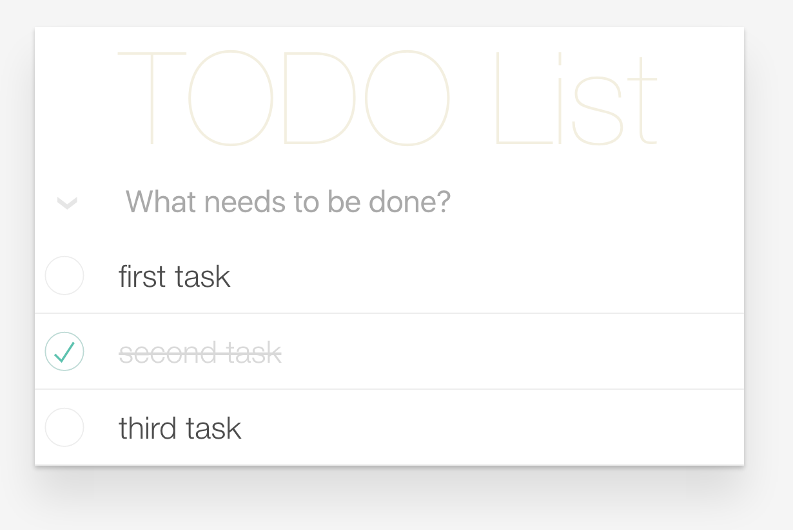
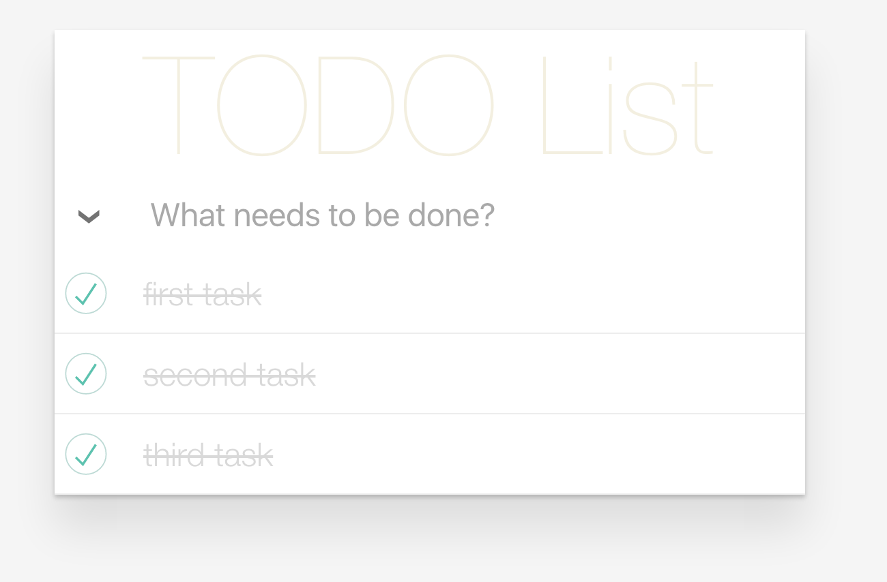
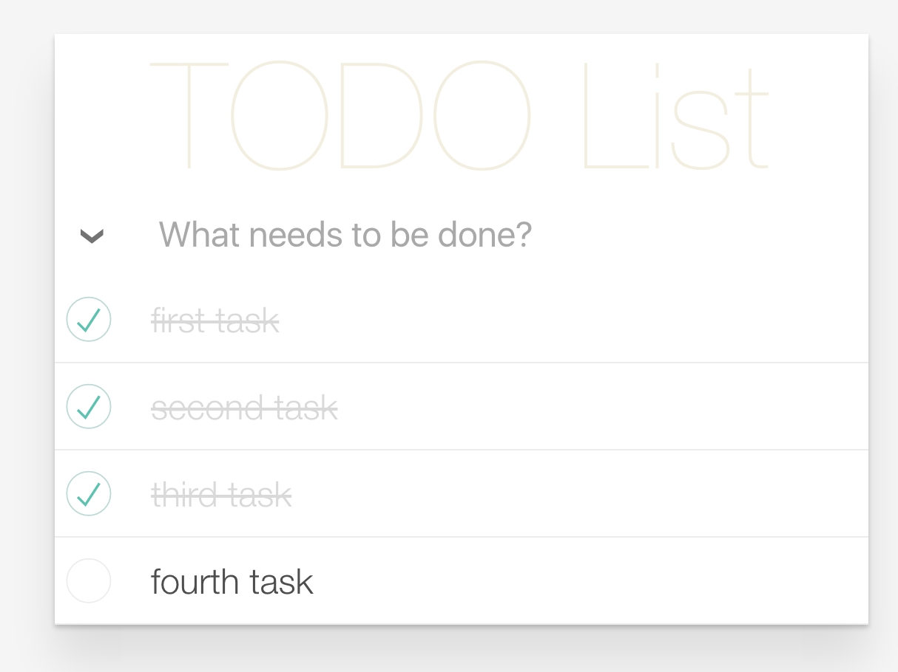

### Todo list example of Vue.js

This is made with [Vue.js](https://vuejs.org/). And this is just todo list app for improving myself.
 
 *Not clear code*

> Vue.js is a library for building interactive web interfaces. It provides data-reactive components with a simple and flexible API.

#### Result image

